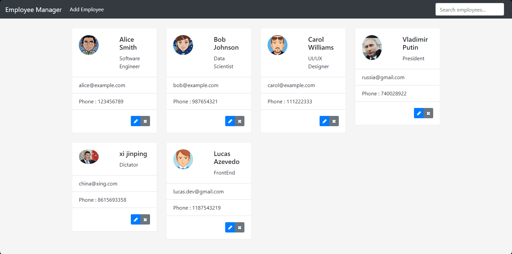

<h1 align="center">API-Angular-SpringBoot-Gerenciador-Funcionarios:</h1>

## 📖 About the project
Project consisting of an API developed with Angular, Bootstrap (frontend), and Spring Boot (backend), along with MySQL as a relational database. The project is an API for employee management, featuring a fully functional CRUD available to the user, allowing them to manipulate their team of employees by editing, creating, or deleting. <br>
VS Code and Eclipse were used as IDEs for coding.

### ‼️ Environment port configuration:
The environment is configured to listen on the following port...
```
├── environments
│ ├── environment.development.ts (here!)
│ └── environment.ts

export const environment = {
    api: 'http://localhost:8080'
};
```



## 🦾 Technologies used
<div style="display: flex;">
  


</div>

## 🤔 What i learned
- I learned how to consume APIs with Angular.
- I improved my skills in componentization.
- I enhanced my skills in SQL, data, and Angular overall.
- I learned how to build a backend with Spring Boot.
- I was able to learn more about systems integration with APIs.

## 👽 How to clone this project

````bash
    # Select where you want to clone
    $ cd ~/Documents/WHERE_YOU_WANT
````

````bash
    # Clone the project
    $ git clone https://github.com/DevGustavus/REPOSITORY_NAME.git
````

````bash
    # Check if cloning worked fine
    $ cd ~/Documents/DIRECTORY_LOCATION
    $ ls
````

## 🅰️ Angular CLI commands to run the project

This project was generated with [Angular CLI](https://github.com/angular/angular-cli) version 16.2.4.

## Development server

Run `ng serve` for a dev server. Navigate to `http://localhost:4200/`. The application will automatically reload if you change any of the source files.

## Code scaffolding

Run `ng generate component component-name` to generate a new component. You can also use `ng generate directive|pipe|service|class|guard|interface|enum|module`.

## Build

Run `ng build` to build the project. The build artifacts will be stored in the `dist/` directory.

## Running unit tests

Run `ng test` to execute the unit tests via [Karma](https://karma-runner.github.io).

## Running end-to-end tests

Run `ng e2e` to execute the end-to-end tests via a platform of your choice. To use this command, you need to first add a package that implements end-to-end testing capabilities.

## Further help

To get more help on the Angular CLI use `ng help` or go check out the [Angular CLI Overview and Command Reference](https://angular.io/cli) page.
